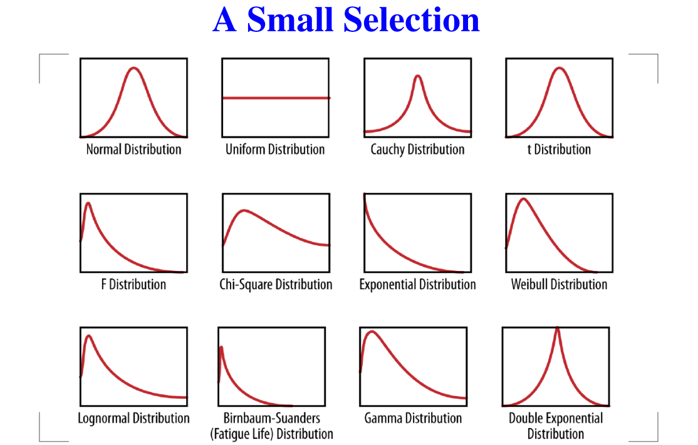

## Reporte 03 de Octubre
## CI-0163   Análisis de Grandes Volúmenes de Datos
## Daniel Ricardo Ramírez Umaña, B45675
***
### 1. Resumen de los temas estudiados (1 pto)
#### &emsp;1.1 Construyendo Modelos
En cuanto al **Análisis Exploratorio de Datos** (*EDA* por sus siglas en inglés) consiste en analizar e investigar los conjuntos de datos con que se van a trabajar y de esta manera tener una mejor noción de como manipular los datos de la mejor manera posible.

Los **modelos** buscan por medio de una herramienta representar al mundo real de la mejor manera posible buscando que este sea lo suficientemente bueno para pronosticar y hacer predicciones que permitan tomar decisiones o sacar conclusiones.

Algunas veces ciertos comportamientos de distribución nos ayudan a tener imformación importante de los datos ya que existen ciertas distribuciones son un patrón muy común en la naturaleza como por ejemplo la *distribución normal*.
*Figura 1: Algunas distribuciones comunes en la naturaleza*

#### &emsp;1.2 Árboles de Decisión
##### &emsp;1.2.1 RandomForest
##### &emsp;1.2.2 GradientBoosting
#### &emsp;1.3 Estategias de Entrenamiento
#### &emsp;1.4 Evaluación y Mejora de Modelos
hhd

### 2. Comentarios sobre algo aprendido (1 pto)

### 3. Dudas sobre la materia estudiada (1 pto)

### 4. Posible uso que usted le dará a esta materia como profesional (1 pto)

### 5. Mencione cualquier material que utilizó como referencia para el aprendizaje (1 pto)

