## Reporte Tarea 1
## CI-0163   Análisis de Grandes Volúmenes de Datos
## Daniel Ricardo Ramírez Umaña, B45675
***
### Información acerca del datasert escogido:
El dataset escogido fue "original_campus_france_rouen_2019_dataset.csv", el cuál fue extraído de la plataforma de **Kaggle** en la sección de **data cleaning datasets** y cuya dirección es https://www.kaggle.com/williamscanisius/campus-france-rouen-2019-dataset?select=original_campus_france_rouen_2019_dataset.csv.

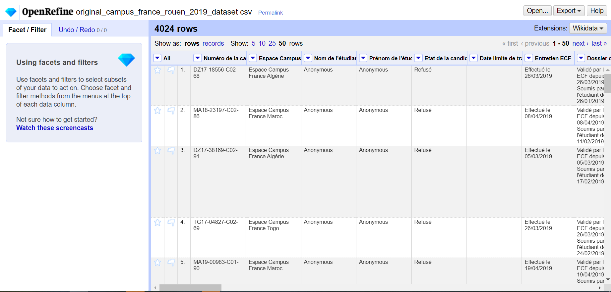*Figura  1: Dataset de Admisión en el Campus France Rouen 2019*

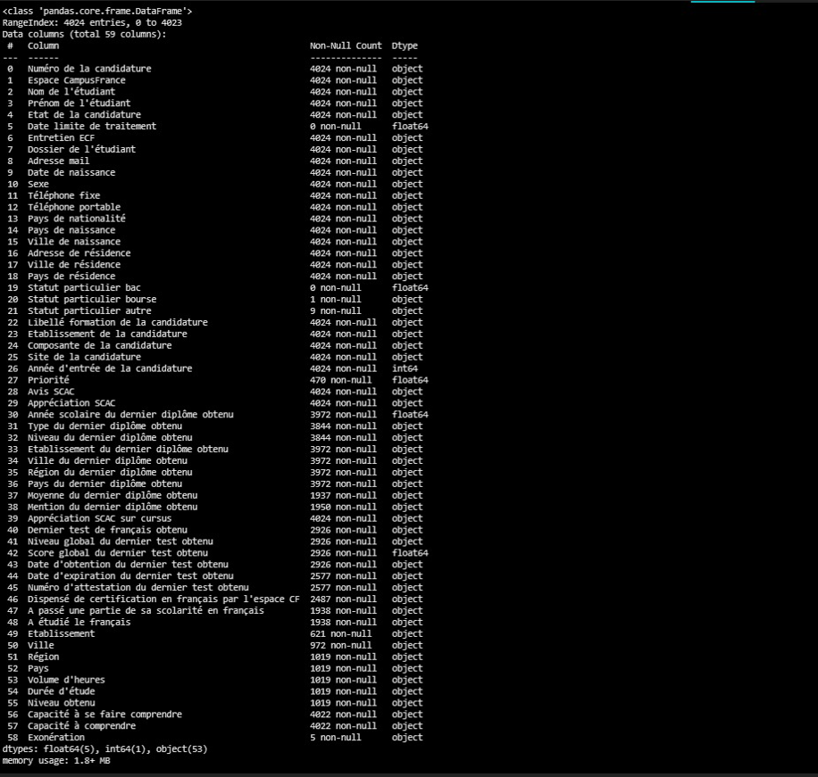*Figura  2: Información general del dataset generada de la función `.info()`*

Como podemos observar en las figuras 1 y 2 el dateset consiste en 4024 observaciones (filas) y 59 columnas (variables)

### 3 Preguntas que quiero estudiar del dataset:
1. ¿Existe alguna correlación entre la variable *Score global du dernier test obtenu* y el estado de la candidatura?
2. ¿Existe una diferencia considerable entre los porcentajes de estados de candidatura según el sexo del aplicante?
3. La prioridad en que una persona candidata es tomada muestra ser una buena señal de que la persona tendrá un buen resultado en su aplicación?

### Primera Fase:
Explorre el data set con las funcionalidades para las cuales OpenRefine se muestra util.
* ###### [10%] Identifique y escriba en su reporte al menos tres problemas (no tribiales y de diferente naturaleza) con los datos y proponga correcciones o alternativas. Haga al menos tres cambios de atributos para corregir los problemas identificados.

* ###### [10%] Siguiendo las preguntas que usted se planteó inicialmente, identifique al menos dos atributos que considera importantes o posiblemente valiosos para resolver dichas preguntas. Liste dichos atributos en su reporte y explique brevemente su fundamentación.

* ###### [10%] Haga al menos dos transformaciones (no tribiales y de diferente naturaleza) en el data set tales como quitar filas o columnas anómalas. Explique el brevemente la fundamentazión de sus transformaciones.
Es necesario antes de trabajar con el dataset hacer unos trabajos con este primero para limpiarlo.

| 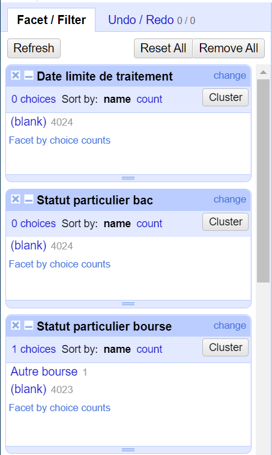 | 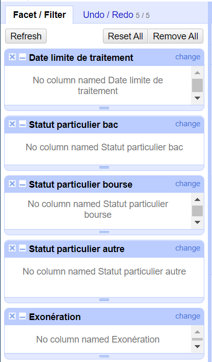 |
|------|------|
| Figura  3: Ejemplo de variables con pocas o ninguna entrada con valor no vacío | Figura  4: Eliminación de variables que aportan muy pocos valores de entrada para generarnos valor considerable |

Entre los tratamientos que requirió el dataset tenemos la presencia de culumnas vacías en las que existe el nombre de la variable en el *header*, pero que sin embargo todas las entradas en esta columna se encuentran vacías. Estas variables o columnas corresponden a las de:
* Date limite de traitement
* Statut particulier bac

O bien variables con muy pocas entradas con valor y todas las demás vacías como:
* Statut particulier bourse (solo una fila con valor 'Autre bourse')
* Statut particulier autre (con 9 de 4024 entradas con valor entre 6 categorías)
* Exonération (tiene solo 5 de las 4024 entradas con valor correspondientes a una sola categoría)

La decisión tomada con respecto a estas columnas fue la de eliminarlas, ya que al haber tan pocos valores esta no nos aportaría mucho valor de estudio.

| 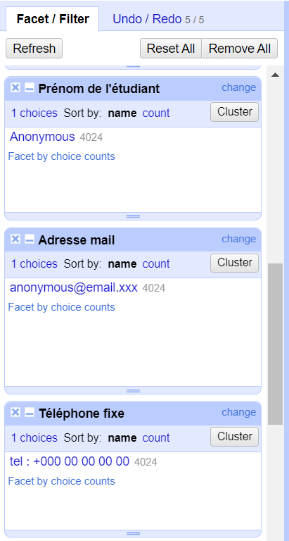 | 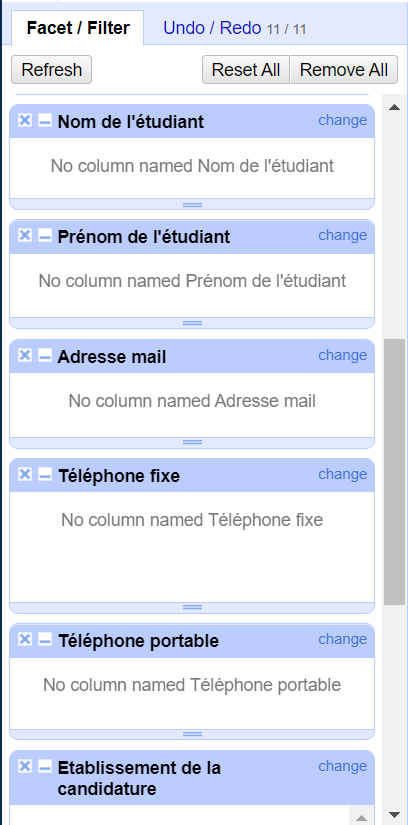 |
|------|------|
| Figura  5: Variables cuya salidas son todas la misma | Figura  6: Eliminación de las columnas cuya salida son todas la misma |

Por otra parte, también contamos con columnas que si bien todas o casi todas son valores no vacíos, como se muestra en la figura 5, todos los valores son el mismo. En estos casos estas columnas tampoco nos aportan mucho valor y como podemos ver en la figura 6 se tomó la decisión de también eliminarlas. Estas columnas corresponden a:
* Nom de l'étudiant (todas 'Anonymous')
* Prénom de l'étudiant (todas 'Anonymous')
* Adresse mail (todas 'anonymous@email.xxx')
* Adresse de résidence (todas 'anonymous address')
* Téléphone fixe (todas 'tel : +000 00 00 00 00')
* Téléphone portable (todas 'tel : +000 00 00 00 00')
* Etablissement de la candidature (todas 'Université de Rouen')
* Composante de la candidature (todas 'Candidatures UFR Sciences Madrillet et ESITECH')
* Site de la candidature (todas 'Site de Saint-Etienne-du-Rouvray')

| 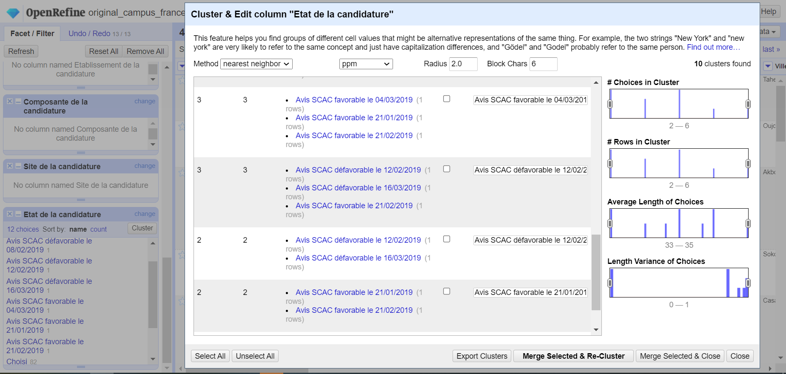 | 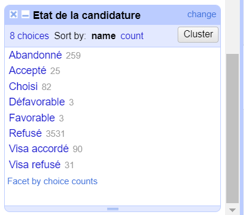 |
|------|------|
| Figura  7: Variables que puedrán tratarse o agruparse en una misma categoría | Figura  8: Valores agrupados por cercanía de valor |

También haciendo *clustering* se agruparon valores con diferencias pequeñas, cada una poco representada y que podrían pertenecer a una misma categoría. En este caso tal y como se ve en la figuta 7 y que como se observa en la figura 8, en esfecto fueron agrupadas. Estas se mencionan a continuación:
* Etat de la candidature:
    * Como Favorable:
        * Avis SCAC favorable le 04/03/2019
        * Avis SCAC favorable le 21/01/2019
        * Avis SCAC favorable le 21/02/2019
    * Como Défavorable
        * Avis SCAC défavorable le 12/02/2019
        * Avis SCAC défavorable le 16/03/2019
        * Avis SCAC favorable le 21/02/2019
        * Avis SCAC défavorable le 08/02/2019
        * Avis SCAC défavorable le 12/02/2019
        * Avis SCAC défavorable le 16/03/2019
        * Avis SCAC défavorable le 12/02/2019
        * Avis SCAC défavorable le 16/03/2019

| 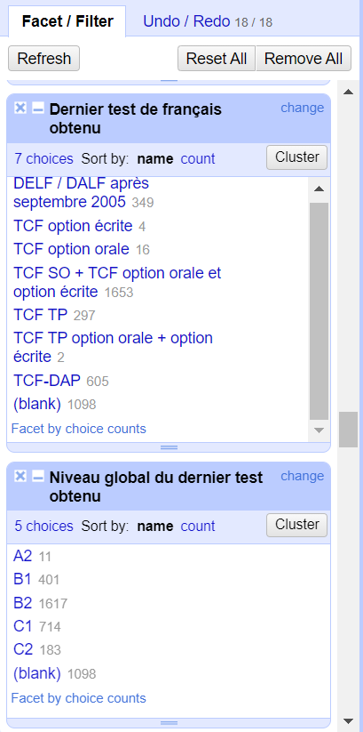 | 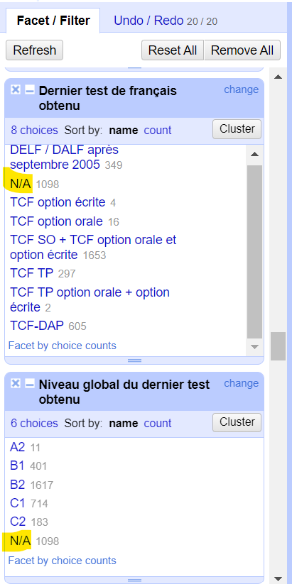 |
|------|------|
| Figura  9: Variables con entradas nulas | Figura  10: Valor por defecto para entradas de valor nulo |

Posteriormente, en las columnas con entradas sin valor (vacío) fueron editadas para que tuvieran un valor por defecto. En el caso de ser de tipo string el valor se cambió por **N/A**, en el caso de enteros y flotantes NO CATEGÓRICOS como un **-1** y en el caso de fechas como un **01/01/1000** dado que es una fecha no esperada y fácil de identificar como *outlier*.

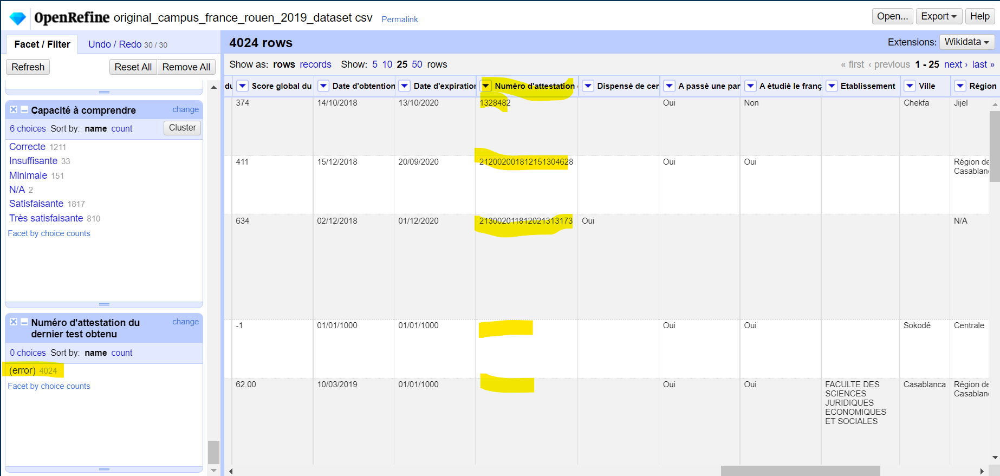*Figura  11: Columna con valores muy atípicos y no consistentes*

Al haber una distribución tan poco común y valores muy distintos o en casos no existentes, la columna que se puede apreciar en la figura 11 se decició sería eliminada.

Finalmente nuestro dataset terminó con un total de __ variables (o columnas).

* ###### [5%] Exportar los resultados del data set con OpenRefine para su posterior uso en un análisis exploratorio.

Se encuentra ya en la carpeta en el repositorio.

* ###### [5%] Exportar el historial de acciones que realizó con OpenRefine (No exportar proyecto, sino el archivo .json con el historial de cambios que realizó).

Se encuentra ya en la carpeta en el repositorio.

### Segunda Fase:
* ###### [5%] Cree un notebook llamado EDA_tarea_1.ipynb  para hacer un análisis exploratorio de datos (Exploratory Data Analysis). Agregue celdas de formato Markdown explicando el proceso que sigue en su EDA.

Ya en la carpeta

* ###### [15%] Utilice y explique brevemente al menos tres técnicas durante su proceso de EDA (e.g. estadística descriptiva, correlaciones, particionamiento de clases, visualizaciones). Incluya una breve interpretación en sus propias palabras de los resultados obtenidos con cada técnica.

1. Para saber si el *Score global du dernier test obtenu* tiene alguna correlación con el estado de la aplicación, realizaré gráficos de cajas (box plots) y veré el comportamiento de estos valores.
2. Para determinar si existe una relación entre el sexo del aplicante y el estado de la candidatura usaré un gráfico de barras con los porcentajes que según sexo se encuentran en determinado estado de proceso.
3. Se hará un gráfico de barras para observar el comportamiento de los estados de aplicación según la prioridad que le asignaron al aplicante.

* ###### [15%] Cree al menos dos gráficas y discuta la distribución de los atributos que consideró de más interés para resolver las preguntas que usted se planteó inicialmente. Las gráficas deben estar bien hechas, identificar el nombre de los datos en cada eje, escala de valores, simbología, y la discusión debe ser congruente con la gráfica.

* ###### [10%] Identifique al menos dos atributos problemáticos que ofrecen poco valor (redundantes, sparce, pocos-valores, etc.).

* ###### [5%] En el notebook  de esta parte EDA_tarea_1.ipynb deben quedar claros cada unos de los pasos anteriores. Agregue encabezados o secciones que ayuden a identificar cada uno de los puntos que se le solicitan en la tarea.

A medida de lo conseguido

### Referencias:
* Campus France Rouen 2019 admission. (2020, June 11). Kaggle. https://www.kaggle.com/williamscanisius/campus-france-rouen-2019-dataset?select=original_campus_france_rouen_2019_dataset.csv
